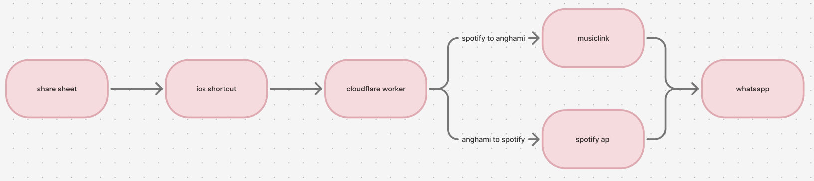

### Spotify <-> Anghami share bridge

[](https://github.com/rachelw320/spotify-anghami-share-bridge/actions/workflows/ci.yml)

A lightweight typescript and cloudflare workers service that converts shared tracks between spotify and anghami and integrates with ios shortcuts for one-tap whatsapp sharing

#### Overview

You share a song from spotify or anghami on your iphone, an ios shortcut sends it to a cloudflare worker, and the worker finds the same song on the other platform. The shortcut then opens whatsapp with a message ready to go that has the converted link in it.

- Spotify -> anghami: send a spotify track id, get back the title, artist and anghami url
- Anghami -> spotify: send the anghami share text (or a title and artist), get back the title, artist and spotify url

#### Why I built it

I use spotify, but someone I send songs to a lot uses anghami, so every time I wanted to share something one of us had to search for it again on the other app. I wanted to be able to hit share and have the right link ready to send straight away, in either direction

It was also a good excuse to work with third-party apis, serverless typescript and ios automation in one small project.

#### How it works

The two directions work differently:

- Spotify -> anghami: spotify url -> musiclink -> anghami url
- Anghami -> spotify: anghami share text -> title/artist extraction -> spotify search api -> best-match scoring -> spotify url

This is because anghami links weren't reliably usable as input to musiclink. So for anghami -> spotify, the worker pulls the title and artist out of the text anghami shares and searches spotify itself.

#### Architecture



The worker doesn't store anything apart from caching the spotify access token in memory. The shortcuts just call the worker and handle the result, they never hold any api credentials

##### Spotify -> anghami flow

1. Share a spotify track from the ios share sheet.
2. The shortcut gets the track id out of the spotify url and calls /?track={id} on the worker.
3. The worker builds the open.spotify.com/track/{id} url and looks it up with musiclink
4. It returns the title, artist and anghami url (with the tracking query parameters removed).
5. The shortcut opens whatsapp with a pre-filled message containing the anghami link.

##### Anghami -> spotify flow

1. Share a song from anghami. Anghami shares text like "Listen to “Song” by Artist on Anghami https://..."
2. The shortcut sends that text to /anghami-to-spotify?share={text} on the worker.
3. The worker extracts the title and artist using a regex.
4. It gets a spotify access token using the client credentials flow, or reuses the cached one if it's still valid.
5. It searches spotify and scores the top 10 results to pick the best match
6. It returns the title (with any ellipses cleaned up), the artist(s) and the spotify url.
7. The shortcut opens whatsapp with a pre-filled message containing the spotify link.

#### Tech stack

- Typescript on cloudflare workers
- Wrangler for local development and deployment
- Spotify web api (client credentials flow and track search)
- Musiclink api (cross-platform track links)
- IOS shortcuts and the share sheet
- Whatsapp wa.me deep links
- Vitest with the cloudflare vitest plugin for tests

#### Key implementation details

- Best-match scoring - each spotify result gets a score for the title and a score for the artist: 6 for an exact match, 3 if one contains the other, 0 otherwise. The highest total wins, and if there's a tie it keeps spotify's original order.
- Normalisation - before comparing, strings are lowercased and have accents and punctuation removed, so "beyoncé" matches "beyonce". Non-latin scripts like arabic are kept
- Title cleaning - ellipses (... or …) in titles are replaced with a space so the whatsapp message looks cleaner.
- Token caching - the spotify token is cached in memory and refreshed 60 seconds before it expires, so it doesn't need to request a new one on every call while the worker is warm.
- Errors - every failure returns json with an error field and a sensible status code (400 for bad input, 404 for no match, 500 for upstream or unexpected errors), so the shortcut can show an alert

##### Project structure

- src/index.ts - request routing and the two conversion handlers
- src/spotify.ts - spotify auth, search and best-match scoring
- src/musiclink.ts - musiclink lookup
- src/text.ts - share text parsing and string normalisation
- test/index.spec.ts - unit tests and request validation tests
- .github/workflows/ci.yml - runs the typecheck and tests on github on every push
- shortcuts/README.md - ios shortcut setup
- docs/architecture.png - the diagram above

#### Setup

You'll need:

- Node.js 22 or later
- A [cloudflare](https://dash.cloudflare.com/) account (the free plan is fine)
- A spotify app from the [spotify developer dashboard](https://developer.spotify.com/dashboard) for a client id and client secret
- A musiclink api key

```bash
git clone https://github.com/<your-username>/spotify-anghami-share-bridge.git
cd spotify-anghami-share-bridge
npm install
```

#### Environment variables

- SPOTIFY_CLIENT_ID and SPOTIFY_CLIENT_SECRET - spotify client credentials, used for anghami -> spotify
- MUSICLINK_API_KEY - used for musiclink lookups (spotify -> anghami)

These are listed as required secrets in wrangler.jsonc, but the actual values are never stored in the repo.

#### Running locally

```bash
cp .dev.vars.example .dev.vars   # add your real values - .dev.vars is git-ignored
npm run dev
```

Then try:

```bash
# spotify -> anghami
curl "http://localhost:8787/?track=<spotify-track-id>"

# anghami -> spotify
curl "http://localhost:8787/anghami-to-spotify?title=Song%20Title&artist=Artist%20Name"
```

To run the checks (github actions runs these on every push too):

```bash
npm run typecheck   # generates the workers runtime types, then runs tsc
npm test
```

#### Deploying with cloudflare wrangler

```bash
npx wrangler login
npx wrangler secret put SPOTIFY_CLIENT_ID
npx wrangler secret put SPOTIFY_CLIENT_SECRET
npx wrangler secret put MUSICLINK_API_KEY
npm run deploy
```

Wrangler prints the worker url (https://{worker-name}.{your-subdomain}.workers.dev), which is what the shortcuts call. The worker name is set in wrangler.jsonc - if you change it, it deploys as a new worker with a new url

#### IOS shortcut setup

You can install both shortcuts straight from icloud: [send to spotify](https://www.icloud.com/shortcuts/cdfa0a6380d54acebf673811421cf302) and [send to anghami](https://www.icloud.com/shortcuts/ced7af39e5fc4072a1e58a85c43fb925). You'll need to replace the placeholders in square brackets (brackets included) with your own worker url and whatsapp number - the full steps are in [shortcuts/README.md](shortcuts/README.md). The last step in each one opens a whatsapp link like wa.me/447XXXXXXXXX?text={message}.

Swap in the recipient's number in international format, or leave the number out and whatsapp will ask you which chat to send it to.

It's a good idea to add both shortcuts to your favourites (share sheet -> edit actions at the bottom -> tap the green +) so they come up at the top straight away when you press share

#### Limitations

- Spotify -> anghami can be slower, because musiclink sometimes has to do cross-platform resolution before it responds.
- Anghami -> spotify relies on anghami's share text format ("Listen to “…” by … on Anghami"). If anghami changes it, parsing will fail with a 400. Passing the title and artist directly gets around this.
- Matching isn't perfect - covers, live versions, remixes or artists with similar names can sometimes return the wrong track
- Spotify search is set to the gb market (SPOTIFY_MARKET in src/spotify.ts).
- Only tracks are supported, not albums, playlists or podcasts.
- The token cache is per worker instance, so a cold start means requesting a new token

#### Security considerations

- Api credentials are stored as cloudflare worker secrets, not in the shortcuts or the repo. The shortcuts only know the worker url.
- .dev.vars, .env files and wrangler's local state are git-ignored, and only placeholder values are committed (.dev.vars.example).
- The worker doesn't log requests, tokens or credentials
- The endpoint isn't authenticated, so anyone with the worker url could call it and use up your spotify and musiclink quota. For personal use I've accepted this, but it's the first thing I'd change (see below).
- Exported .shortcut files aren't included since they can contain personal phone numbers.

#### Possible future improvements

- Require a shared secret header from the shortcuts, or add rate limiting.
- Accept full spotify and anghami urls as well as ids or share text
- Support albums and playlists.
- Add a minimum match score so it returns "no match" instead of a weak guess.
- Cache track pairs that have already been resolved (e.g. in workers kv) to make repeat lookups faster.
- Make the spotify market configurable with an environment variable

#### License

[Mit](LICENSE)
