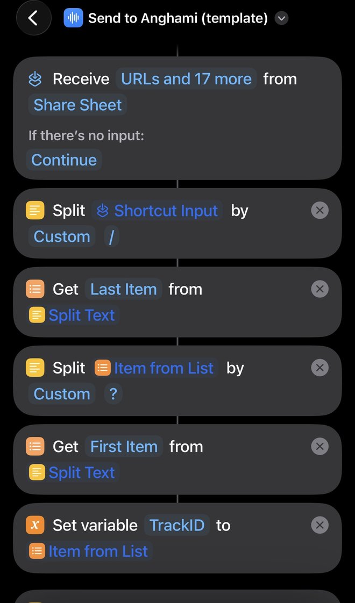
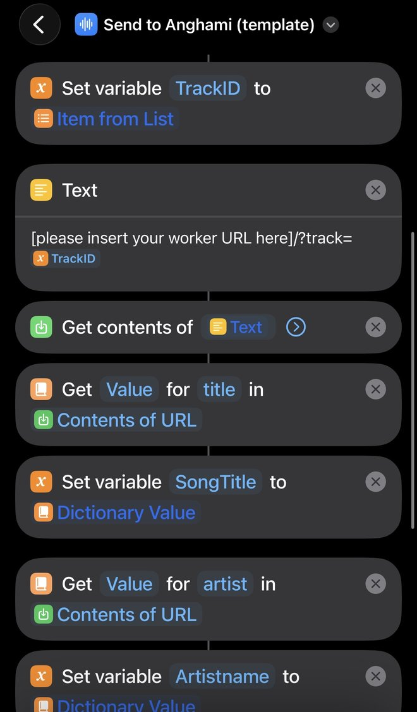
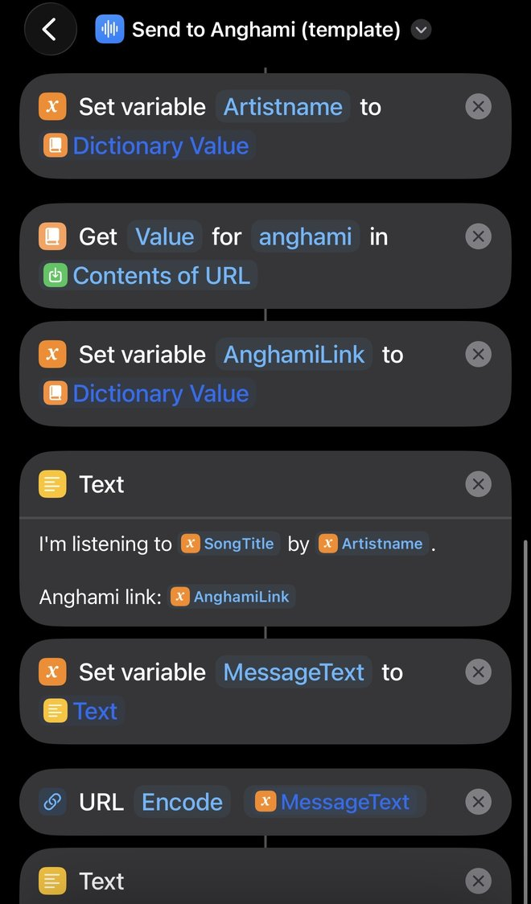
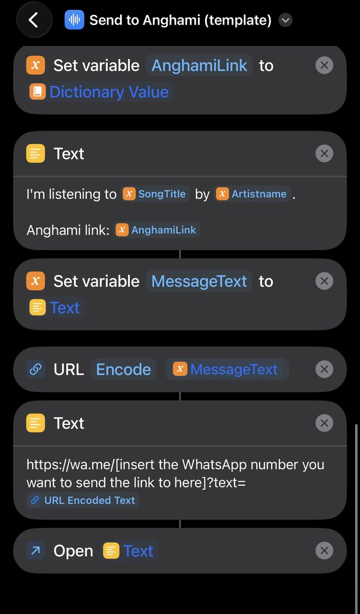
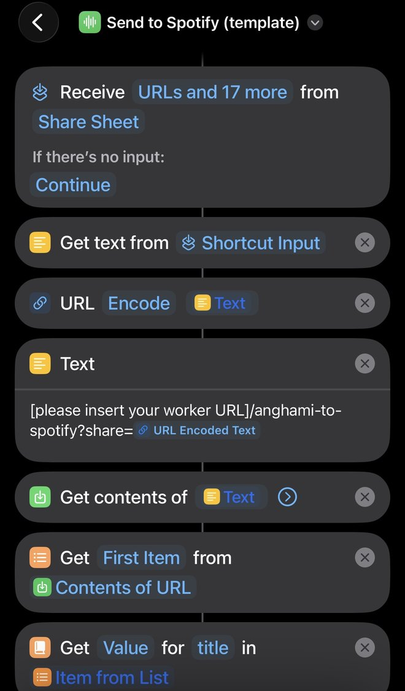
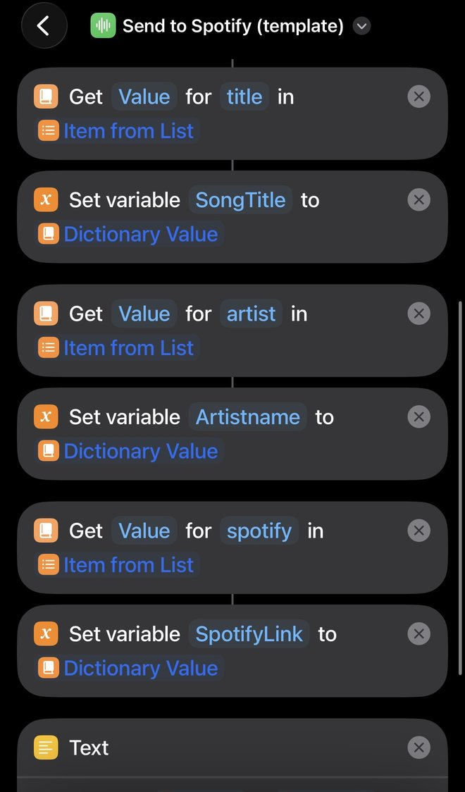
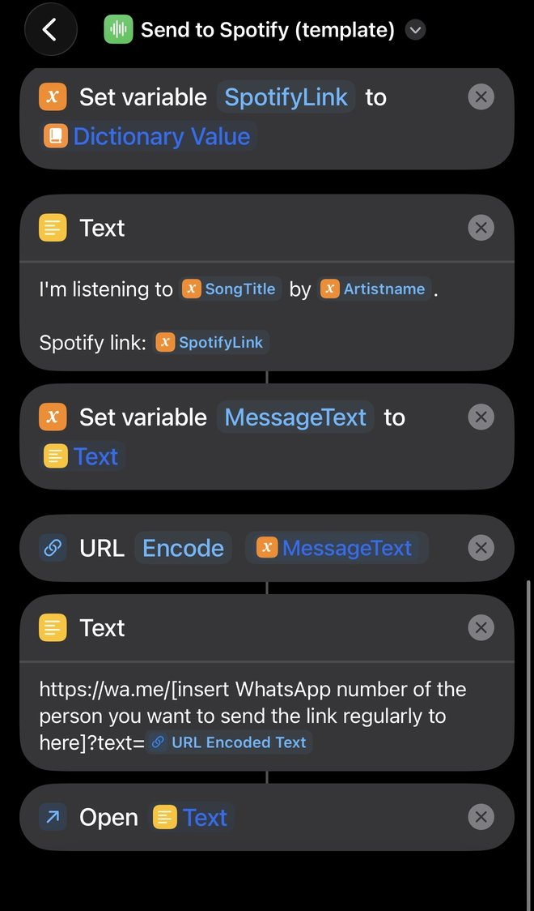

### IOS shortcut setup

There are two ios shortcuts, one for each direction. Both show up in the share sheet and end by opening whatsapp with a pre-filled message

#### Install them

- [Send to spotify](https://www.icloud.com/shortcuts/cdfa0a6380d54acebf673811421cf302) (anghami -> spotify)
- [Send to anghami](https://www.icloud.com/shortcuts/ced7af39e5fc4072a1e58a85c43fb925) (spotify -> anghami)

Open the links on your iphone and tap add shortcut (or if you'd rather build them yourself, there are screenshots of every action further down). They won't work straight away, you need to fill in two things in each one first

#### Setting them up

Each shortcut has two text actions with a placeholder in square brackets, e.g. [please insert your worker URL here]. Replace the whole thing, including the [ and ] brackets, with your own value.

To edit a shortcut, open the shortcuts app, tap the ... on the shortcut, then tap into the text you want to change.

In send to anghami:

1. The text action straight after 'set variable TrackID' - replace [please insert your worker URL here] with your worker url
2. The text action straight after 'url encode MessageText' (near the bottom) - replace [insert the WhatsApp number you want to send the link to here] with the whatsapp number

In send to spotify:

1. The text action straight after the first 'url encode' (near the top) - replace [please insert your worker URL] with your worker url
2. The text action straight after 'url encode MessageText' (near the bottom) - replace [insert WhatsApp number of the person you want to send the link regularly to here] with the whatsapp number

What to put in:

- Worker url - your deployed worker, e.g. https://spotify-to-anghami.your-subdomain.workers.dev (no slash at the end)
- Whatsapp number - the number you want to send links to, in international format without the +, spaces or the leading zero, e.g. 447XXXXXXXXX

So for example, this:

```
[please insert your worker URL here]/?track=
```

should end up like:

```
https://spotify-to-anghami.your-subdomain.workers.dev/?track=
```

If you leave the brackets in, the link won't work.

In the steps further down, anything in curly brackets like {TrackID} is one of the blue variables that's already in the shortcut - leave those alone, it's only the square bracket bits you need to change

Your spotify and musiclink credentials don't go in the shortcuts - they're stored as cloudflare worker secrets.

#### Add them to your favourites

So they come up at the top of the share sheet straight away:

1. Share any song from spotify or anghami so the share sheet opens.
2. Scroll to the bottom of the list of actions and tap edit actions.
3. Tap the green + next to send to anghami and send to spotify to add them to favourites
4. Tap done. They'll now show at the top of the list every time you press share.

#### 1. Send to anghami (spotify -> anghami)

If you can't or don't want to use the icloud link, you can build it yourself from these screenshots (top to bottom, left to right) and the steps underneath

<p>
   
</p>

1. Receive urls (and other types) from the share sheet.
2. Split the shortcut input by a custom separator of /, then get the last item. For a spotify link that's the track id followed by ?si=...
3. Split that by ?, then get the first item. This is the spotify track id, saved as the TrackID variable
4. Text action with the worker url:
   ```
   [please insert your worker URL here]/?track={TrackID}
   ```
5. Get contents of that url.
6. Get the title, artist and anghami values from the response and save them as SongTitle, Artistname and AnghamiLink.
7. Text action with the message, e.g. "I'm listening to SongTitle by Artistname. Anghami link: AnghamiLink", saved as MessageText.
8. Url encode MessageText
9. Text action with the whatsapp link:
   ```
   https://wa.me/[insert the WhatsApp number you want to send the link to here]?text={URL Encoded Text}
   ```
10. Open that text, which opens whatsapp with the message ready to send.

The worker sends back json with title, artist, anghami and musiclink fields.

This one can take a few seconds, since musiclink sometimes has to resolve the track across platforms first

#### 2. Send to spotify (anghami -> spotify)

Same again for this one - screenshots top to bottom, left to right, then the steps.

<p>
  
</p>

Anghami shares text like "Listen to “Song Title” by Artist Name on Anghami https://open.anghami.com/..." and the worker pulls the title and artist out of that.

1. Receive urls (and other types) from the share sheet.
2. Get text from the shortcut input.
3. Url encode the text.
4. Text action with the worker url:
   ```
   [please insert your worker URL]/anghami-to-spotify?share={URL Encoded Text}
   ```
5. Get contents of that url, then get the first item from it
6. Get the title, artist and spotify values and save them as SongTitle, Artistname and SpotifyLink.
7. Text action with the message, e.g. "I'm listening to SongTitle by Artistname. Spotify link: SpotifyLink", saved as MessageText.
8. Url encode MessageText.
9. Text action with the whatsapp link:
   ```
   https://wa.me/[insert WhatsApp number of the person you want to send the link regularly to here]?text={URL Encoded Text}
   ```
10. Open that text, which opens whatsapp.

The worker sends back json with title, artist and spotify fields.

You can also skip the share text and pass the title and artist directly, e.g. your-worker-url/anghami-to-spotify?title=Song%20Title&artist=Artist%20Name

#### Tips

- If you want to pick who to send it to each time, leave the number out completely (wa.me/?text=...) and whatsapp will ask you which chat to use
- If something isn't working, add a 'quick look' after 'get contents of url' to see the worker's json response. Every error response has an error field that says what went wrong.
